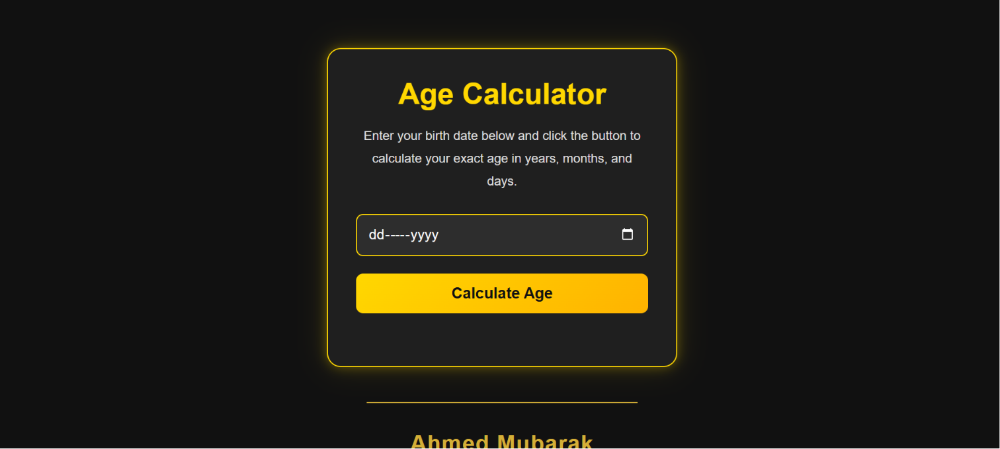

# ⏳ Age Calculator

  

  A modern and responsive Age Calculator built with HTML, CSS, and JavaScript. It accurately calculates your age in years, months, and days with a clean gold-themed user interface.

  <a href="https://age-calculator-your-vercel-link.vercel.app" target="_blank">🌐 Live Demo</a> •
  <a href="https://github.com/ahmedmubarak2010/Age-Calculator" target="_blank">📂 GitHub Repository</a>

---

## ✨ Features

- 📅 Calculate exact age in **Years, Months, and Days**
- ⚠️ Input validation
- 🚫 Prevents selecting future dates
- 🎨 Modern Gold & Dark UI
- 📱 Fully Responsive Design
- ⚡ Fast and Lightweight
- 🌐 Custom Favicon
- 👨‍💻 Professional Footer with Social Links

---

## 🛠️ Built With

- HTML5
- CSS3
- JavaScript (ES6)

---

## 📸 Screenshots

### Home

  

### Result

  

---

## 🚀 Live Demo

👉 **https://age-calculator-your-vercel-link.vercel.app**

---

## Contact Me

  

  

  

  

## Author

**Ahmed Mubarak**
---

## ⭐ Support

If you like this project, consider giving it a ⭐ on GitHub.

---

## 📄 License

This project is licensed under the MIT License.